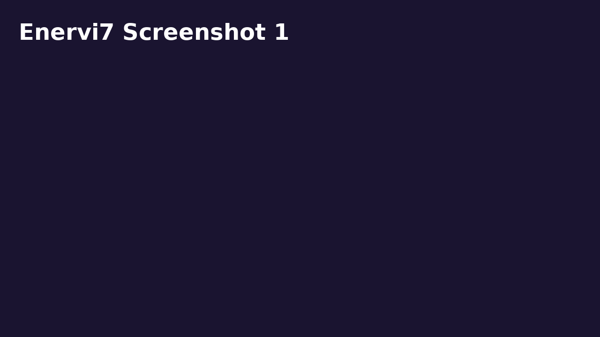
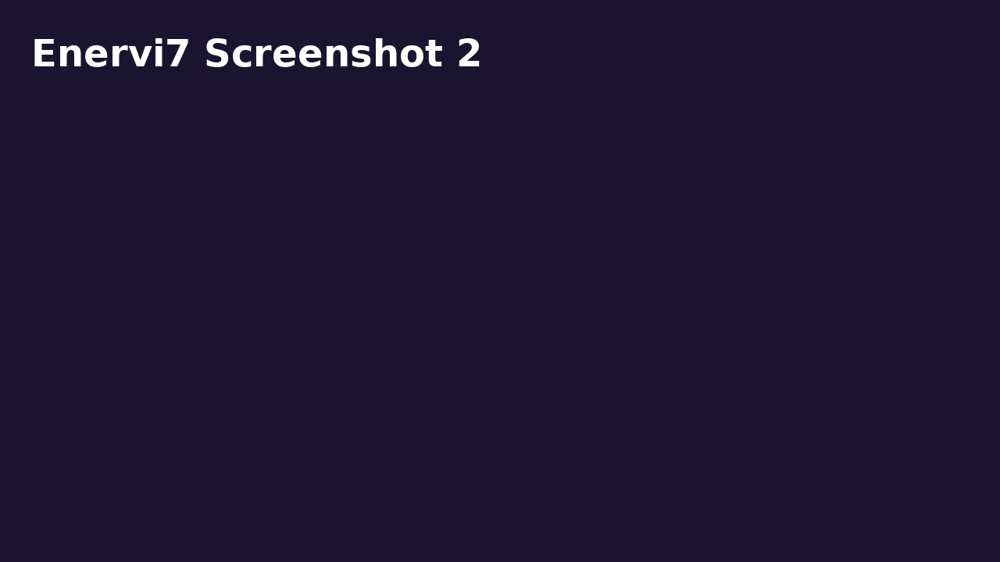

# ✨ Enervi7 PWA （完整版）

一款結合 **Enervi7 七階能量量表 × 今日指引 × 精油系統** 的 Progressive Web App。  
支援 **14 題量表測驗、雷達圖視覺化、七階行動建議、精油建議（含 Young Living 全系列複方）**，並可安裝到手機，離線使用。

🌐 **Demo 網址**：  
👉 [https://octo701028-sudo.github.io/Mixenervi7/](https://octo701028-sudo.github.io/Mixenervi7/)

---

## 🚀 功能特色
- **14 題能量量表**：0 = 完全不符合 ／ 10 = 非常符合  
- **能量雷達圖**：自動計算七階平均分數，生成直觀圖表  
- **今日指引卡**：優勢之光、補給之光、今日行動、靈光啟示  
- **七階資訊卡**：關鍵字 × 行動建議 × 單方精油 × Young Living 複方精油 × 常見卡點  
- **今日建議精油**：隨機推薦（支援 YL 全系列資料庫，100+ 款）  
- **PWA 支援**：可安裝至桌面／主畫面，支援離線模式  

---

## 📸 介面截圖

| 首頁 | 量表測驗 | 雷達圖與指引 |
|------|-----------|-------------|
|  |  |  |

---

## 📂 專案結構
```
Mixenervi7/
 ├── index.html          # 主程式
 ├── manifest.json       # PWA 設定
 ├── sw.js               # Service Worker
 ├── yl_blends.json      # Young Living 複方精油資料庫
 ├── icon-192.png        # PWA 圖示 (192x192)
 ├── icon-512.png        # PWA 圖示 (512x512)
 ├── screen1.png         # 截圖1
 ├── screen2.png         # 截圖2
 ├── screen3.png         # 截圖3
 └── README.md           # 專案說明
```

---

## 📖 使用方式
1. 進入 Demo 網址，開始進行量表測驗  
2. 調整 0–10 的滑桿，點擊「生成能量圖」  
3. 查看 **能量雷達圖、行動卡、今日精油建議**  
4. 在手機上 → 點「加入主畫面」即可安裝成 App，離線可用  

---

## 🌈 靈性應用場景
- 個人每日能量檢測  
- 靜心／冥想／靈性工作坊的輔助工具  
- 與精油搭配的日常能量校準  
- 自我覺察與顯化練習  

---

💜 **Enervi7 PWA** 讓每一次呼吸，都是一個新的開始。
